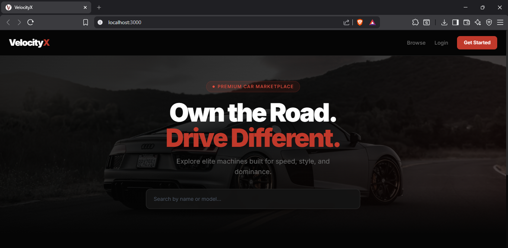
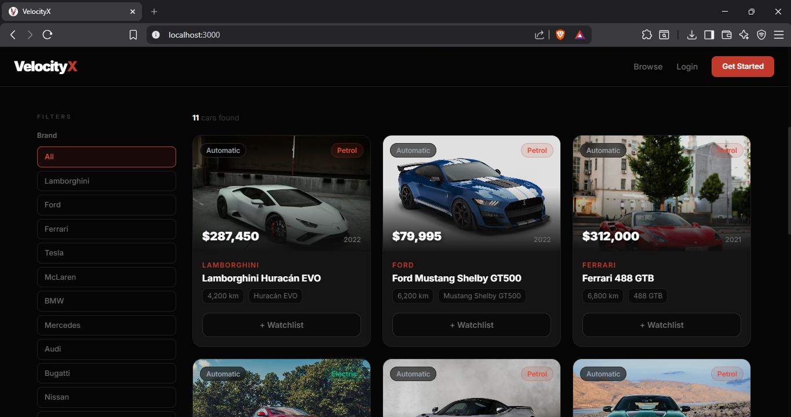
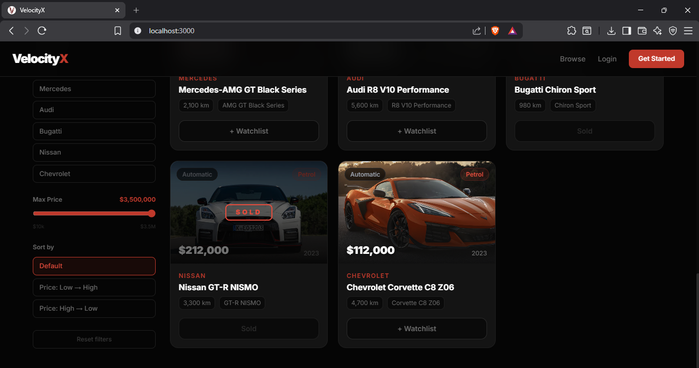
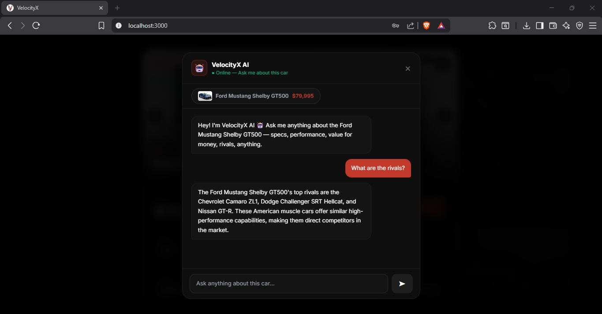
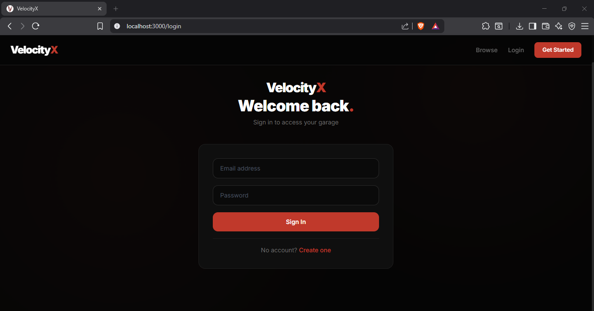
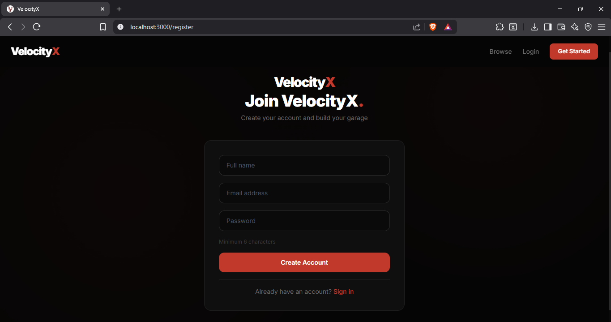
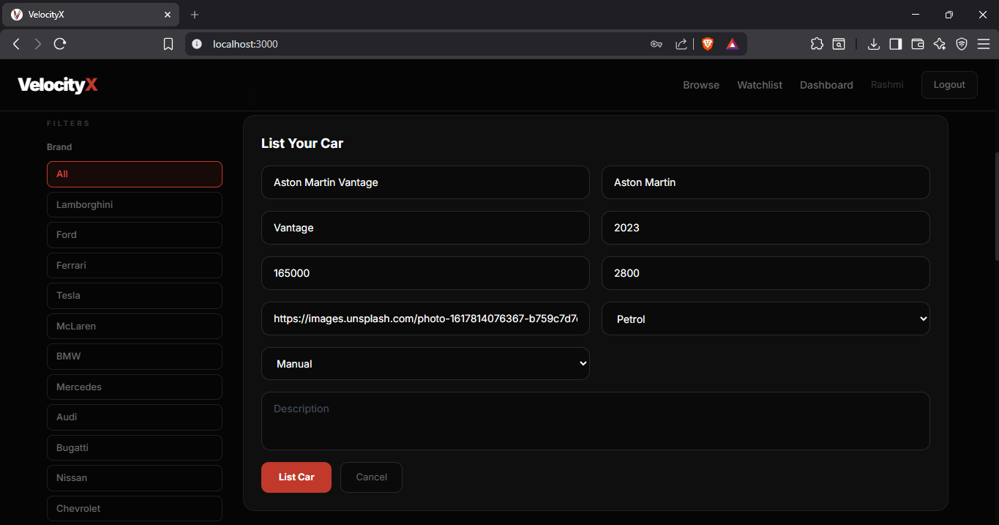
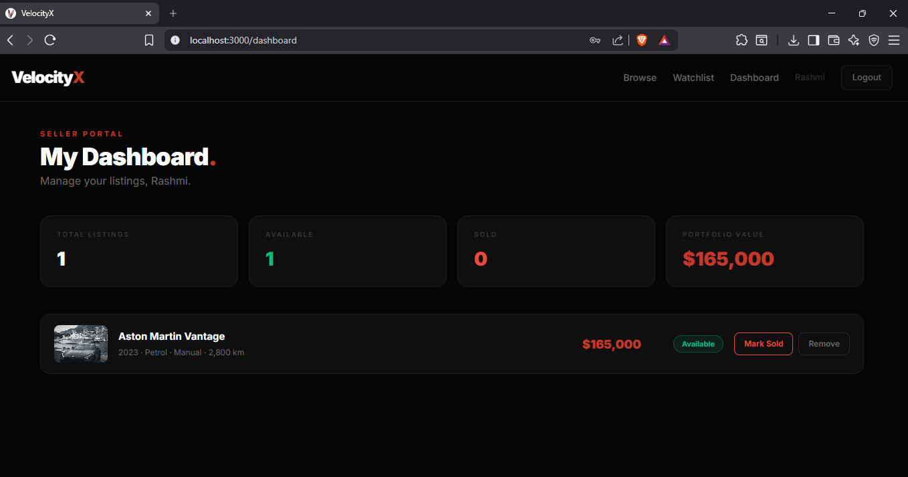
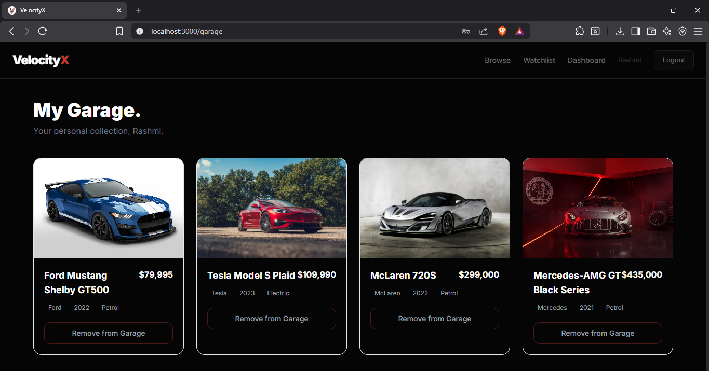
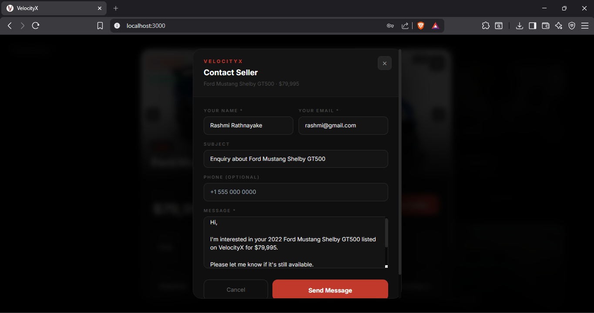

<div align="center">

# VelocityX 🚗
### Premium Car Marketplace & Garage App

[](https://mongodb.com)
[](https://expressjs.com)
[](https://reactjs.org)
[](https://nodejs.org)
[](https://jwt.io)
[](https://groq.com)

A full-stack MERN car marketplace where users can browse premium vehicles, save cars to their personal Watchlist, chat with an AI car advisor, contact sellers directly, and manage their own listings via a seller dashboard.

[Features](#features) · [Tech Stack](#tech-stack) · [Getting Started](#getting-started) · [API Reference](#api-reference) · [Project Structure](#project-structure) · [Demo](#demo)

</div>

---

## Features

- 🔐 **JWT Authentication** — Secure register & login with bcrypt password hashing
- 🚗 **Car Listings** — Browse, search and filter 12 premium cars with real images
- 🖼️ **Image Carousel** — 360° style multi-photo gallery per car listing
- 📋 **Car Detail Modal** — Full specs, description, seller info in a premium overlay
- 🤖 **VelocityX AI** — Chat with an AI advisor about any car (powered by Groq LLaMA 3.3, free)
- ❤️ **Watchlist** — Save cars to a personal collection, remove anytime
- 📧 **Contact Seller** — One-click email pre-filled with car details and buyer name
- 🟢 **Available / Sold Status** — Sellers can mark cars as sold, buyers see it instantly
- 🏪 **Seller Dashboard** — Manage listings with stats (total, available, sold, portfolio value)
- 💰 **Price Filter Slider** — Filter by budget in real time
- ↕️ **Sort by Price** — Low to high or high to low
- 🔗 **Share a Car** — Copy listing link to clipboard
- 💨 **Animated Splash Screen** — Speedometer rev animation on app load
- 📱 **Responsive UI** — Works on mobile, tablet, and desktop


## Tech Stack

| Layer | Technology |
|-------|-----------|
| Frontend | React 18, React Router v6, Axios, Tailwind CSS v3 |
| Backend | Node.js, Express.js |
| Database | MongoDB (local dev), MongoDB Atlas (production) |
| Auth | JSON Web Tokens (JWT), bcryptjs |
| AI | Groq API — LLaMA 3.3 70B (free tier) |
| Styling | Tailwind CSS + custom dark red premium theme |
| Dev Tools | Nodemon, dotenv |

---

## Screenshots

### Home Page






### AI chat Page


### Login Page


### Signup Page


### List Page


### Seller Dashboard


### Personal Watchlist (Garage)
\


### Contact Page



## Getting Started

### Prerequisites

- [Node.js](https://nodejs.org/) v18+
- [MongoDB](https://mongodb.com/) (local) or [MongoDB Atlas](https://cloud.mongodb.com) (free cloud)
- [Groq API key](https://console.groq.com) (free, no credit card needed)

### 1. Clone the repository

```bash
git clone https://github.com/YOUR_USERNAME/velocityx-mern.git
cd velocityx-mern
```

### 2. Install dependencies

```bash
# Backend
cd backend
npm install

# Frontend
cd ../frontend
npm install
```

### 3. Set up environment variables

Create `backend/.env`:

```env
MONGO_URI=mongodb://localhost:27017/velocityx
JWT_SECRET=velocityx_super_secret_2024
PORT=5000
NODE_ENV=development
```

### 4. Add your Groq API key

Open `frontend/src/components/CarAI.jsx` and replace:
```js
const GROQ_API_KEY = 'gsk_YOUR_GROQ_KEY_HERE';
```
Get your free key at [console.groq.com](https://console.groq.com) — no credit card needed.

### 5. Start MongoDB

```bash
# Windows
net start MongoDB

# macOS/Linux
mongod
```

### 6. Seed the database

```bash
cd backend
npm run seed
```

Creates 12 premium car listings and a demo account:
- **Email:** admin@velocityx.com
- **Password:** velocityx123

### 7. Run the app

Open two terminals:

```bash
# Terminal 1 — Backend
cd backend
npm run dev

# Terminal 2 — Frontend
cd frontend
npm start
```

Visit **http://localhost:3000** 🚀


## API Reference

### Auth Routes
| Method | Endpoint | Description | Auth |
|--------|----------|-------------|------|
| POST | `/api/auth/register` | Register new user | ❌ |
| POST | `/api/auth/login` | Login, returns JWT | ❌ |

### Car Routes
| Method | Endpoint | Description | Auth |
|--------|----------|-------------|------|
| GET | `/api/cars` | Get all cars (`?search=&brand=`) | ❌ |
| POST | `/api/cars` | Create a new listing | ✅ |
| DELETE | `/api/cars/:id` | Delete your listing | ✅ |
| PATCH | `/api/cars/:id/status` | Mark as Sold / Available | ✅ |

### Watchlist Routes
| Method | Endpoint | Description | Auth |
|--------|----------|-------------|------|
| GET | `/api/garage` | Get your watchlist | ✅ |
| POST | `/api/garage/add/:carId` | Add car to watchlist | ✅ |
| DELETE | `/api/garage/remove/:carId` | Remove from watchlist | ✅ |

---

## Project Structure

```
velocityx-mern/
├── backend/
│   ├── config/
│   │   └── db.js                 # MongoDB connection
│   ├── middleware/
│   │   └── authMiddleware.js     # JWT verification
│   ├── models/
│   │   ├── User.js               # User schema + bcrypt
│   │   ├── Car.js                # Car schema (images, status)
│   │   └── Garage.js             # Watchlist schema
│   ├── routes/
│   │   ├── authRoutes.js         # Register & login
│   │   ├── carRoutes.js          # Car CRUD + status toggle
│   │   └── garageRoutes.js       # Watchlist management
│   ├── seeder.js                 # 12 premium cars seed script
│   ├── server.js                 # Express + static frontend serve
│   └── .env                      # Environment variables
│
├── frontend/
│   └── src/
│       ├── components/
│       │   ├── Navbar.jsx            # Nav + watchlist badge
│       │   ├── CarCard.jsx           # Car listing card
│       │   ├── CarModal.jsx          # Full detail overlay
│       │   ├── ImageCarousel.jsx     # Multi-photo carousel
│       │   ├── CarAI.jsx             # AI chat (Groq LLaMA 3.3)
│       │   ├── SplashScreen.jsx      # Speedometer animation
│       │   └── Toast.jsx             # Toast notification system
│       ├── pages/
│       │   ├── HomePage.jsx          # Browse, filter, sidebar
│       │   ├── LoginPage.jsx         # Authentication
│       │   ├── RegisterPage.jsx      # Registration
│       │   ├── GaragePage.jsx        # Personal watchlist
│       │   └── DashboardPage.jsx     # Seller portal
│       ├── api.js                    # Axios + interceptors
│       └── App.js                    # Routes & layout
│
└── README.md
```

---

## Key Concepts Demonstrated

- **RESTful API design** with Express.js and proper HTTP methods (GET, POST, PATCH, DELETE)
- **JWT-based authentication** with protected routes and middleware
- **MongoDB schema design** with Mongoose and document references (`ref`, `populate`)
- **React state management** with hooks (`useState`, `useEffect`, `useRef`)
- **Axios interceptors** for automatic auth header injection on every request
- **Component-based architecture** with reusable, single-responsibility components
- **AI integration** using Groq API (LLaMA 3.3 70B) for real-time car advisor chat
- **Environment-based configuration** with dotenv for dev/production switching
- **Single URL deployment** — React build served statically from Express in production

---


## Author

**Rashmi Rathnayake**
Final Year Software Engineering Undergraduate

[](https://github.com/rashdiwsl)
[](https://www.linkedin.com/in/rashmi-rathnayaka2001/)

---

<div align="center">
Built with ❤️ as a final year MERN stack project · Powered by Groq AI
</div>
